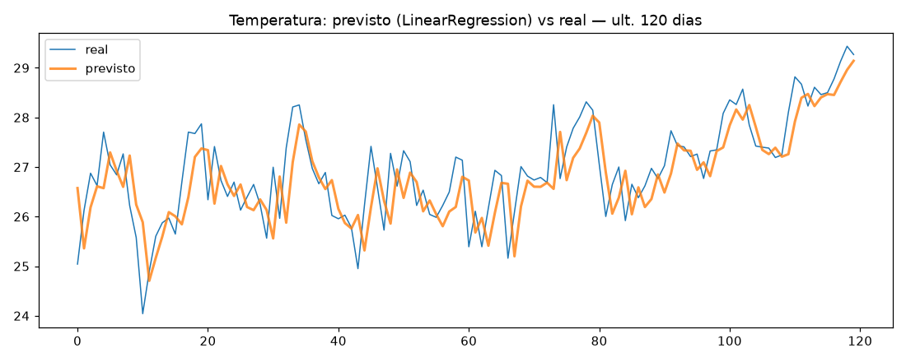
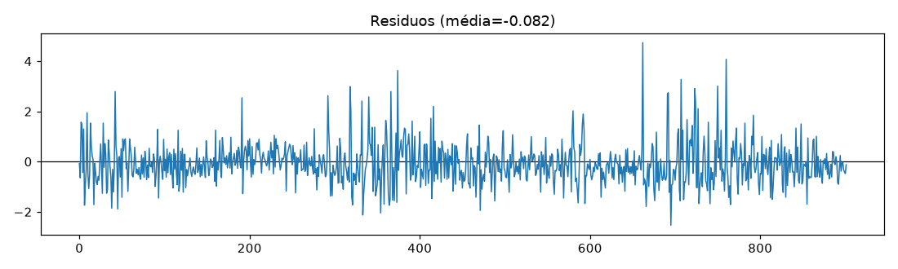
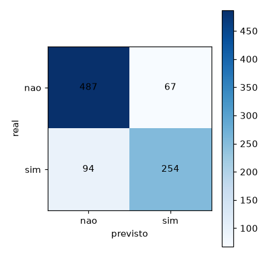

# ml-svc-lab

Laboratório pessoal de estudos de **Machine Learning** — um guarda-chuva para
experimentar técnicas em vários domínios. Cada experimento é autocontido e
compartilha um núcleo de utilitários transversais. O primeiro experimento é
previsão do tempo (séries temporais); outros domínios entram como novos `experiments/`.

## Estrutura

```
ml-svc-lab/
├── common/                 # utilitários TRANSVERSAIS (qualquer experimento)
│   ├── data.py             # I/O (CSV/Parquet)
│   ├── metrics.py          # regressão (MAE/RMSE) + classificação (acc/F1/AUC)
│   ├── splits.py           # split TEMPORAL (sem shuffle) e split aleatório
│   └── plots.py            # previsto×real, resíduos, matriz de confusão
├── experiments/
│   └── weather/            # 1º experimento — clima (séries temporais)
│       ├── ingest_openmeteo.py  # baixa histórico (Open-Meteo, SEM chave)
│       ├── features.py          # features + 2 alvos (temp e chuva)
│       ├── windowing.py         # janelas deslizantes (-> sklearn e Keras)
│       ├── baseline.py          # persistência / naive sazonal / climatologia
│       └── train_sklearn.py     # modelos sklearn vs baselines + plots
├── tests/                  # pytest do common
├── Makefile · requirements.txt · ruff.toml · .github/workflows/ci.yml
```

## Experimento weather — alvos

A partir da série diária, prevemos o **dia seguinte**:
- **Temperatura média** — regressão (métrica: MAE/RMSE)
- **Choveu? (>1 mm)** — classificação (métrica: F1/AUC; acurácia engana com classe desbalanceada)

## Como rodar

```bash
make setup            # instala dependências
make ingest           # baixa o histórico de Teresina via Open-Meteo (sem chave)
make baseline         # roda os baselines (a régua dos modelos)
make test             # pytest
make lint             # ruff

# Fase 1 — modelos sklearn vs baselines (gera plots e tabela):
PYTHONPATH=. python3 -m experiments.weather.train_sklearn
```

## Baselines (a régua que os modelos de ML precisam bater)

Todo modelo só "vale" se superar o baseline ingênuo. No dado real de Teresina, a
persistência ("amanhã = hoje") entrega temperatura com erro baixíssimo (MAE ≈
0.64 °C), e a classificação de chuva mostra a armadilha clássica: prever "nunca
chove" tem acurácia alta mas F1 = 0. Por isso medimos F1/AUC, não acurácia.

## Resultados — Fase 1 (dado real de Teresina)

Modelos clássicos (sklearn) vs os baselines, no conjunto de teste temporal.
Régua: temperatura **MAE 0.637** · chuva **F1 0.759** (persistência).

| Alvo | Modelo | Métrica | Bateu baseline? |
|------|--------|---------|:---:|
| Temperatura | persistência (baseline) | MAE=0.637 
| Temperatura | LinearRegression | MAE=0.615  
| Temperatura | Ridge(α=1) | MAE=0.615  
| Temperatura | MLPRegressor | MAE=0.638  
| Chuva | persistência (baseline) | F1=0.759  
| Chuva | LogisticRegression | F1=0.750 (AUC=0.900) 
| Chuva | MLPClassifier | F1=0.759 (AUC=0.895) 

**Leitura:** na temperatura, a regressão linear supera a persistência por pouco
(0.615 vs 0.637) e o MLP **piora** — num sinal quase-determinístico, mais
complexidade não ajuda. Na chuva, a Logística não bate o F1 mas tem **AUC 0.900**
(ranqueia bem o risco; falta calibrar o limiar de decisão — próxima melhoria).

<div align="center">







</div>

## Metodologia (e honestidade)

Este é um **estudo de método**, não um previsor que compete com serviços oficiais
(INMET/NWP usam campos espaciais, física e satélites; um modelo de estação única
não os supera). O valor está no rigor: baselines, **split temporal sem vazamento**,
e comparação justa. A mesma disciplina se aplicará aos próximos domínios.

## Dados

Open-Meteo Historical Weather API (ERA5, desde 1940, sem chave). Migração futura
para INMET BDMEP (estações brasileiras reais). Os CSVs não são versionados —
gere com `make ingest`.

## License

MIT — Silas Vasconcelos Cruz ([s-v7](https://github.com/s-v7))
